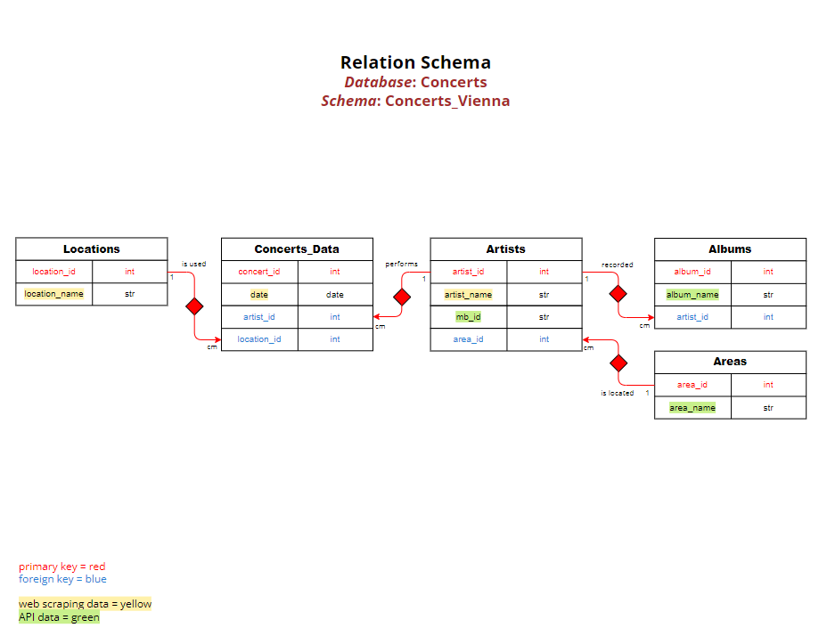

# Python Project: Concerts Vienna

## Concept
This script gathers data on current concerts in Vienna from [Metal-Hammer](https://www.metal-hammer.de/alle-konzerte-in/wien/) through web scraping
and retrieves data about these artists from the [MusicBrainz API](https://musicbrainz.org/doc/MusicBrainz_API). The collected data is stored
in a PostgreSQL relational database and some insights are visualized with charts.

### Relation Schema

## Project Structure
The project structure includes the following modules stored in the "modules" folder and called in the main.py file:

**web_logger.py** 
Performs web scraping to extract details such as date, location and artist of current rock and metal concerts in Vienna from the Metal-Hammer website.

**api_logger.py** 
Utilizes the MusicBrainz API to retrieve the MusicBrainz ID, current area and album names for each artist scheduled to perform in Vienna. 
Utilizes the Spotify API to retrieve the top tracks of a specific artist.

**database.ini** 
Contains parameters for connecting to a PostgreSQL database. 
IMPORTANT: Fill out database.ini with your data before running the code!

**config.py** 
Provides a function to create a dictionary with the parameters from database.ini. 
This dictionary is used in the safe_data.py module to establish a connection to your database management system.

**safe_data.py** 
Contains functions to create a PostgreSQL database and a class to create and populate tables with all data.

## MusicBrainz API Workflow
In order to connect to the MusicBrainz API, the following steps are necessary. 

Connection:
- Create a header with a user-agent string in the format *'yourname/MusicBrainzVersion ( email@provider.com )'*
- Include the header in the GET request.

Get data:
- The main request URL is https://musicbrainz.org/ws/2/
- Specify the URL depending on the data you want to retrieve. You can search for an artist or obtain specific information about an artist.
- If you search by name, also similar results will be returned. Example request URL for searching:
  - request_url = 'https://musicbrainz.org/ws/2/artist?query=${artistName}&fmt=json'
- To retrieve information for a specific artist, use the MusicBrainzID. Example request URL:
  - request_url = 'https://musicbrainz.org/ws/2/artist/${artistId}?inc=aliases&fmt=json'

## Spotify API Workflow
Spotify has a [detailed documentation](https://developer.spotify.com/documentation/web-api) on how to connect to the API. 

Summary Steps:
- Log into your Spotify Account and go to the dashboard.
- Create an app to authorize usage and access a token.
- Obtain an access token and include it in the header.
- Customize the URL 'https://api.spotify.com/v1/' to suit your needs and connect to the API.
